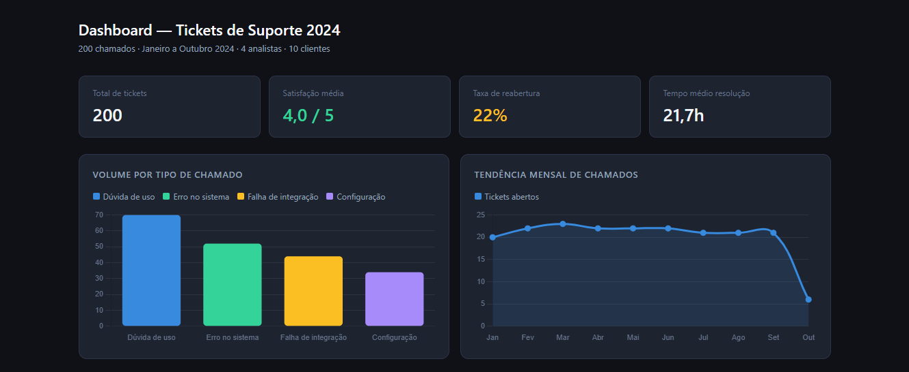
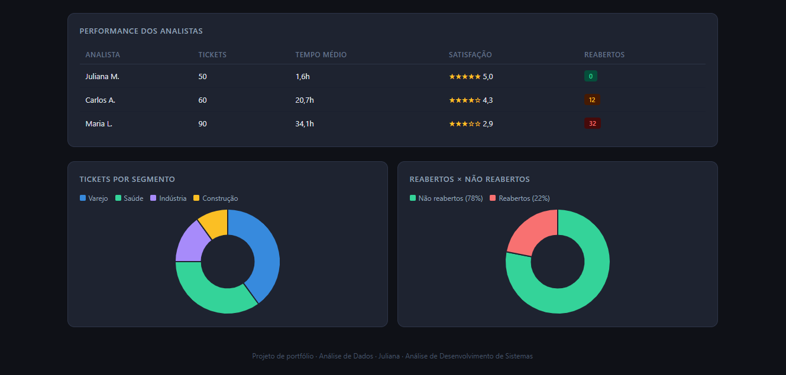

## Análise de Tickets de Suporte Help Desk 2024

Projeto de análise de dados voltado à identificação de gargalos operacionais, avaliação de desempenho e melhoria da qualidade no atendimento técnico, utilizando MySQL e Power BI. A análise foi construída a partir de um dataset de 200 chamados de suporte registrados ao longo de 2024, simulando um cenário real de tomada de decisão em ambientes corporativos e identificando padrões, gargalos e oportunidades de melhoria no processo de atendimento.

## Objetivo
Identificar padrões e problemas operacionais no atendimento de suporte técnico, simulando o trabalho de um analista de suporte ao responder questões de negócio como:

- Quais tipos de chamado geram mais retrabalho?
- Quais clientes e segmentos apresentam pior satisfação?
- O SLA está sendo cumprido conforme a prioridade?
- Como é o desempenho individual dos analistas?
- Existe impacto da reabertura na satisfação do cliente?
- Qual é a tendência mensal de volume de chamados?

## Estrutura do Projeto

```
analise-tickets-suporte/
├── ingressos.csv              # Dataset com 200 registros
├── analise_tickets.sql        # Queries de análise
├── dashboard_tickets.pbix     # Dashboard Power BI
├── painel.html                # Versão web do dashboard
├── imagens/                   # Prints do dashboard
└── README.md
```
---

## Dicionário de Dados

| Coluna | Tipo | Descrição |
|---|---|---|
| `id_ticket` | VARCHAR | Identificador único do chamado |
| `data_abertura` | DATE | Data de abertura do ticket |
| `data_fechamento` | DATE | Data de encerramento do ticket |
| `cliente` | VARCHAR | Nome do cliente |
| `segmento` | VARCHAR | Segmento de mercado do cliente |
| `sistema` | VARCHAR | Sistema relacionado ao chamado (ERP, CRM, PDV) |
| `tipo_chamado` | VARCHAR | Categoria: Dúvida de uso, Erro no sistema, Falha de integração, Configuração |
| `prioridade` | VARCHAR | Nível: Baixa, Média, Alta, Crítica |
| `status` | VARCHAR | Situação atual do ticket |
| `analista` | VARCHAR | Analista responsável pelo atendimento |
| `tempo_resolucao_horas` | INT | Tempo total para resolução (em horas) |
| `satisfacao_cliente` | INT | Nota do cliente de 1 a 5 |
| `reaberto` | VARCHAR | Indica se o ticket foi reaberto (Sim/Não) |

---

## Antes da análise, foram realizadas etapas de preparação:

- Padronização de categorias (tipo de chamado, prioridade, status)
- Verificação e tratamento de valores inconsistentes
- Criação de métricas derivadas:
- Tempo de resolução
- Cumprimento de SLA
- Taxa de reabertura 

##  Análises Realizadas

### 1. Visão Geral
- Total de tickets e distribuição por status

### 2. Tipo de Chamado e Prioridade
- Volume por tipo com tempo médio de resolução e satisfação
- Comparação de SLA entre níveis de prioridade

### 3. Cumprimento de SLA
Critérios definidos:
| Prioridade | SLA definido |
|---|---|
| Crítica | ≤ 48 horas |
| Alta | ≤ 72 horas |
| Média | ≤ 120 horas |
| Baixa | Sem restrição |

### 4. Reincidência e Qualidade
- Taxa de reabertura geral e por tipo de chamado
- Correlação entre reabertura e satisfação do cliente

### 5. Performance dos Analistas
- Volume atendido, tempo médio e satisfação por analista

### 6. Segmento e Clientes
- Segmentos com maior volume de chamados críticos
- Clientes com satisfação abaixo da meta (< 4)

### 7. Tendência Mensal
- Evolução do volume, tempo e satisfação ao longo dos meses

---

## Dashboard Power BI

O dashboard foi construído com base nas queries SQL e apresenta:

- **KPIs principais**: total de tickets, taxa de SLA, satisfação média e taxa de reabertura
- **Gráfico de barras**: volume por tipo de chamado
- **Gráfico de linhas**: tendência mensal de chamados
- **Tabela de analistas**: performance individual comparada
- **Mapa de calor**: segmento × prioridade

---
### Visão Geral



## Tecnologias Utilizadas


---

## Principais Insights

- Falhas de integração apresentam maior tempo de resolução e maior taxa de reabertura, configurando o principal gargalo operacional  
- Chamados críticos de clientes específicos, como Construtora Beta e TechParts Ltda, concentram os maiores desvios de SLA  
- Tickets reabertos apresentam menor satisfação média, indicando baixa efetividade na resolução inicial  
- O volume de chamados cresce no segundo semestre, sugerindo possível sazonalidade no suporte  
---

## Conclusões e Recomendações
- Priorizar melhorias em falhas de integração (processo ou sistema)
- Investir em treinamento para reduzir reabertura de chamados
- Monitorar clientes com maior volume de tickets críticos
- Revisar estratégias de atendimento em períodos de maior demanda

##  Autora

**Juliana Silva** | Estudante de Análise e Desenvolvimento de Sistemas   
[LinkedIn](#) • [GitHub](#)
